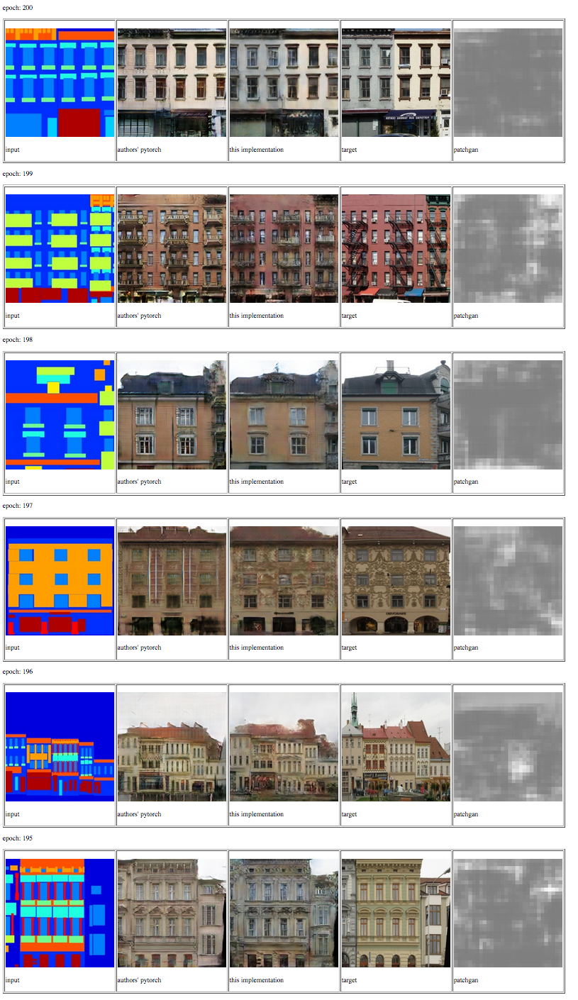

# pix2pix in Tensorflow and Keras

An implementation of the pix2pix [paper](https://arxiv.org/pdf/1611.07004.pdf) using Keras to build models and Tensorflow in eager execution mode to train.



## Install dependencies

Tensorflow 1.13.1 requires CUDA 10 drivers if running on GPU, installation steps [here](https://www.tensorflow.org/install/gpu#install_cuda_with_apt). If running on CPU, change `tensorflow-gpu` to `tensorflow` in `requirements.txt`.

Setup python environment:
```
python -m venv venv
source venv/bin/activate
pip install -r requirements.txt
```

## Train model

Download facades dataset:

```
bash download_dataset.sh facades
```

Preprocess data:

```
python preprocess.py
```

Train:
```
python train.py --experiment_title my_experiment
```
View results: Open `results/index.html` in your browser to view training progress visualisations, including training plots and checkpoint images for each epoch.

### References

- [30] A. Radford, L. Metz, and S. Chintala. Unsupervised representation learning with deep convolutional generative adversarial networks. arXiv preprint arXiv:1511.06434, 2015.
- [34] O. Ronneberger, P. Fischer, and T. Brox. U-net: Convolutional networks for biomedical image segmentation. In MIC- CAI, pages 234–241. Springer, 2015. 2, 3, 4
- https://arxiv.org/pdf/1611.07004.pdf
- https://richzhang.github.io/ideepcolor/
- http://richzhang.github.io/colorization/


